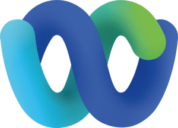

# Kosha Webex Messaging Connector

Primarily known for its video conferencing capabilities, the Webex platform also includes a powerful messaging application. 

Using the Kosha Webex Messaging connector, you can perform REST API operations to create, update, and delete messages. Using the Webex Messaging API, your Kosha workflow or application can directly access the Webex platform to:

* Create a Webex space and invite people
* Search for people in your company
* Post messages in a Webex space
* Get Webex space history or be notified in real-time when new messages are posted by others
* Execute a command on a Webex RoomOS device

## Useful Actions 

You can use the Kosha Webex Messaging connector to perform to manage messages, rooms, teams, and people.  

Refer to the Webex connector [API specification](openapi.json) for details.

### Messages

 In Webex, messages are sent directly between users or between multiple users in rooms. Webex displays each message on its own line along with a timestamp and sender information. You can send messages formatted in plain text or Markdown, and send file attachments along with your messages.

You must be a member of a space to target it with the Messaging API.

### Rooms

Rooms are virtual meeting spaces where people post messages and collaborate on work. Use the Rooms API to create and delete rooms and update rooms to change their titles or make them public.

### Teams

Teams are groups of people with a set of rooms that are visible to all members of that team. Use the Teams API to create and delete teams and update teams to change their names.

### People

People are registered users of Webex. Use the People API to list, create, update, and delete users.

## Example Usage

For methods that accept request parameters the platform accepts either `application/json` or `application/x-www-form-urlencoded` content types and currently only supports returning data in `application/json` format.

< sdk example? >

## Authentication

To use the Webex REST API, you need a Webex account. The Kosha Webex Messaging connector uses `API_KEY` based auth using your personal access token.
